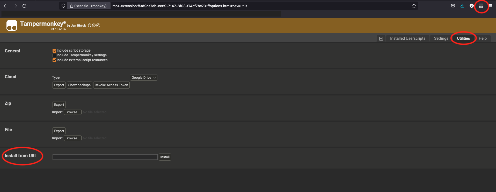

# README

The repo hosts various user scripts that can be used in conjunction with Tampermonkey/Greasemonkey etc

# Prerequisites

Install Greasemonkey or Tampermonkey extension in your browser.  
Note: You only need either one. Both are great, I use Tampermonkey as it is available in both Firefox and Chrome

[Tampermonkey install instructions](https://www.tampermonkey.net/faq.php#Q100)

[Greasemonkey](https://addons.mozilla.org/en-US/firefox/addon/greasemonkey/)

# Install user script

The easiest way is to:

1. Click on the Tampermonkey extension icon and open the Dashboard.
2. Click 'Create a new script'. This opens the script editor.
3. Replace the auto-generated content with the corresponding script from this repo.

Or from the script file's raw Github url:

1. Copy the script file raw url 
   Eg: https://raw.githubusercontent.com/vissree/browser-user-scripts/master/label\_oci\_console/label_oci_console.js
2. Tampermonkey Dashboard -> Utilities -> Install from URL

3. Paste the raw url and click 'Install'
