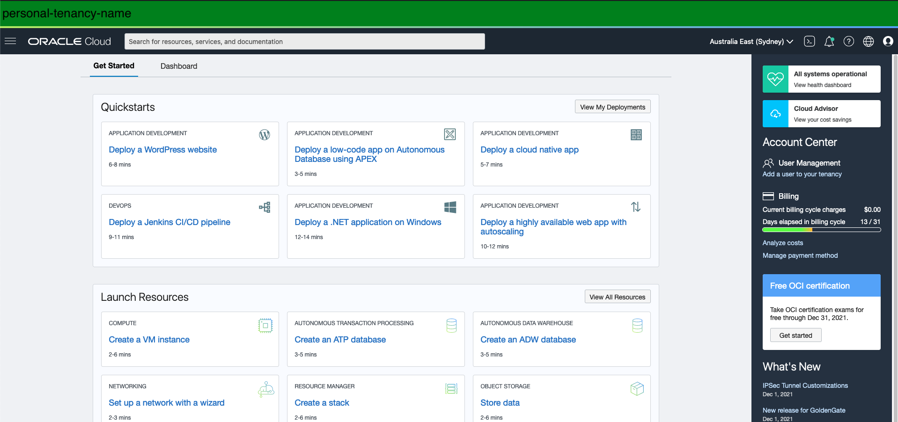
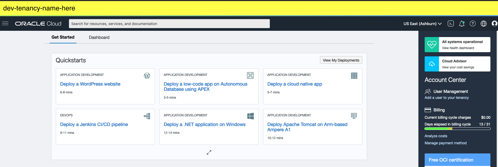
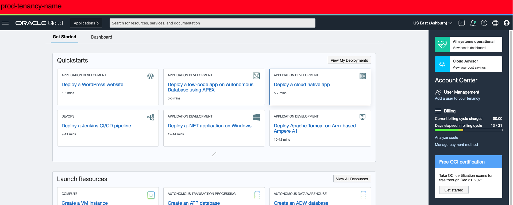

# Label OCI Console

Add a color coded banner to the top of the console to distinguish between tenancies (prod/dev/stage/personal).

# Tenancies

The tenancy list is maintained in the `tenancies` object. Edit the members as required. For example, to add personal tenancies.

# Screenshots

### Personal

### Dev/Test/Stage

### Production

